# RP.Sound — the physics and psychology of game audio, explained

> A procedural audio library for C#, written to be **read and understood** before it is used.
> It is a **tutorial in code**: a guided tour of how real sounds come to exist — why steel rings
> and wood thuds, why a bounce accelerates, why a horror scene *feels* like horror — aimed at
> anyone meeting procedural audio for the first time. Nothing here plays back recordings: every
> sound is **synthesised from a description** of the physical event or emotional intent behind it,
> with the science explained at every step. It is the companion to
> [RP.Math](../Math/README.md) and follows the same design philosophy: small immutable value
> objects, uniform conventions applied without exception, clarity ahead of speed.

---

## Contents

- [What this project is for](#what-this-project-is-for)
- [Conventions used across the library](#conventions-used-across-the-library)
- [The types at a glance](#the-types-at-a-glance)
- [The core: buffers, frequencies, levels, envelopes](#the-core-buffers-frequencies-levels-envelopes)
- [Synthesis: oscillators, noise, and a plucked string](#synthesis-oscillators-noise-and-a-plucked-string)
- [The synthesizer: one architecture worth learning](#the-synthesizer-one-architecture-worth-learning)
- [Effects: filters, echo, reverb, distortion](#effects-filters-echo-reverb-distortion)
- [Physical modelling: how objects sound](#physical-modelling-how-objects-sound)
  - [Materials](#materials)
  - [Modal bodies — an object's voice](#modal-bodies--an-objects-voice)
  - [Impact](#impact)
  - [Gravity and the bounce](#gravity-and-the-bounce)
  - [Scrape and roll](#scrape-and-roll)
  - [Granular surfaces (PhISEM)](#granular-surfaces-phisem)
  - [Footsteps](#footsteps)
  - [Whoosh — the sound of speed](#whoosh--the-sound-of-speed)
- [Instruments: a rhythm section from first principles](#instruments-a-rhythm-section-from-first-principles)
- [Ambience: wind, rain, fire, thunder](#ambience-wind-rain-fire-thunder)
- [Mood, tension and genre](#mood-tension-and-genre)
- [Background music: genres as specifications](#background-music-genres-as-specifications)
- [Games: a science-fiction palette](#games-a-science-fiction-palette)
- [Playback: hearing it in real time](#playback-hearing-it-in-real-time)
- [Layering: keeping every sound functional](#layering-keeping-every-sound-functional)
- [The showcase application](#the-showcase-application)
- [Academic sources](#academic-sources)
- [Decisions captured here](#decisions-captured-here)
- [Future considerations](#future-considerations)
- [Status and history](#status-and-history)

---

## What this project is for

Game audio is usually made by recording thousands of samples and triggering them. That works, but
it teaches nothing, scales badly (every material × velocity × surface combination is another
recording), and cannot respond continuously to physics. **Procedural audio** — synthesising the
sound from the event itself — is the other road (Farnell's *Designing Sound* is its manifesto),
and it is a wonderful teaching vehicle, because every sound becomes a small physics lesson:

- An **impact** is loud in proportion to its kinetic energy and bright in proportion to its
  hardness, because hard contact is *brief* contact and brief pulses carry high frequencies.
- A **bounce** accelerates audibly because each interval is `2v/g` and `v` shrinks geometrically.
- **Thunder** rumbles when distant because air eats high frequencies first.
- A **horror scene** unsettles because dissonance, low register, darkness and unresolved
  expectation are each measurable, mappable quantities.

This library covers the sound palette a triple-A game needs — contact sounds driven by velocity,
gravity, mass and material; granular surfaces and footsteps; whooshes; generative weather beds;
mood-driven underscore and tension devices; and a mixing layer that keeps it all intelligible —
each grounded in the published research ([sources below](#academic-sources)) and documented as a
teaching resource. The code favours clarity over raw DSP speed, exactly as RP.Math favours
readable maths over SIMD.

---

## Conventions used across the library

Stated once, applied everywhere, no exceptions — cohesion is a discipline, not an adjective.

**Everything audible is an immutable description implementing one contract.** `ISound` has a
`Duration` (which may be `PositiveInfinity` — wind has no natural end) and
`Render(context, duration)`, which always returns *exactly* the requested length. Descriptions
never change; operations return new descriptions; rendering never mutates the description.

**Rendering is a pure function: (description, context) ⇒ identical samples, every time.** The
`AudioRenderContext` carries the sample rate and master seed; components derive named random
streams from it, so composing sounds never disturbs each other's randomness. Same seed, same
audio — a bounce heard in a replay is the bounce that was heard live. The test suite holds every
stochastic generator to this.

**Units are always wrapped.** A bare `double` never leaves you guessing: pitch is a `Frequency`
(hertz ↔ MIDI note ↔ note name), loudness is a `Level` (linear gain ↔ decibels) — the same
discipline RP.Math applies to angles with `Angle`. A bare number converts implicitly where the
reading is fixed (a double *is* hertz, as a double *is* radians); construction that asserts a
precondition is explicit. Physical quantities are SI: metres, m/s, kg, kg/m³, pascals.

**Strict and safe forms.** Normalising silence is undefined: `Normalized()` throws
(`NormalizeSilentBufferException`), `NormalizedOrDefault()` returns the buffer unchanged.
`Frequency.FromNote` throws on nonsense; `TryFromNote` reports false. Same pattern, everywhere
it applies.

**Static and instance forms of buffer operations** (`AudioBuffer.Mix(a, b)` / `a.MixedWith(b)`),
with the instance form calling the static one, so the two can never disagree.

**Invalid states are unconstructible.** A `Material` cannot have negative density; a `Mood`
cannot leave the valence–arousal–tension box; an `Echo` cannot be built with unity feedback (it
would never decay); restitution of 1 is rejected (the bounce would never end). Constructors
validate; the type system holds the line after that.

**What a sound *is* is separate from *where it sits*.** Sounds are mono descriptions; pan and
distance belong to a `SoundPlacement`, and role/priority to a `MixLayer` — the same split
RP.Math draws between a conceptual shape and the `Pose` that places it. Only the mix is stereo.

**Transient render state is the one sanctioned exception to immutability.** A random generator
mid-stream and a filter mid-signal are stateful by nature (`DeterministicRandom`, the internal
`Biquad`). They are never part of a description — they are created inside `Render` and die there.

---

## The types at a glance

```mermaid
graph TD
    ISound["ISound<br/>description ⇒ deterministic samples"]

    subgraph core["Core values"]
        AB["AudioBuffer"] --- FR["Frequency<br/>Hz · MIDI · note name"] --- LV["Level<br/>linear · dB"] --- EN["Envelope"]
    end

    subgraph synth["Synthesis"]
        OSC["Oscillator"] --- NOI["Noise<br/>white/pink/brown"] --- KS["PluckedString<br/>(Karplus–Strong)"] --- SW["FrequencySweep"]
        LFO["Lfo<br/>vibrato · wobble · tremolo"] --> SPX["SynthPatch<br/>osc → filter → amp"] --> SYN["Synthesizer"]
        LFO --> FM["FmOscillator<br/>carrier × modulator (DX7)"]
    end

    subgraph inst["Instruments"]
        DRUMS["KickDrum · SnareDrum · HiHat<br/>TomDrum · Cymbal"] --- STR["BassGuitar · Guitar<br/>(Jaffe–Smith extensions)"] --- MALL["Mallet<br/>marimba · xylophone · glockenspiel"] --- WINDS["Organ · Flute · Brass · SynthPad"]
    end

    subgraph genres["Background music"]
        GRV["Groove<br/>tempo · meter · swing"] --> TRK["BluesTrack · RockTrack · DubstepTrack<br/>HouseTrack · ElectronicaTrack"]
    end

    subgraph phys["Physics — Gaver's taxonomy"]
        MAT["Material"] --> MB["ModalBody<br/>material + size ⇒ modes"]
        MB --> IMP["Impact"] --> BON["BounceSequence"]
        MB --> SCR["Scrape"]
        MB --> ROL["Rolling"]
        PS["ParticleSurface<br/>(PhISEM)"] --> FS["Footsteps"]
        MAT --> FS
        WH["Whoosh<br/>(Strouhal)"]
    end

    subgraph amb["Ambience"]
        WIND["Wind"] --- RAIN["Rain"] --- FIRE["Fire"] --- THU["Thunder"]
    end

    subgraph mood["Mood & tension"]
        MD["Mood<br/>valence · arousal · tension"] --> SC["Scale"] --> DR["Drone"]
        MD --> ST["Stinger"] --- SH["ShepardTone"] --- RI["Riser"] --- HB["Heartbeat"]
        MD --> GS["GenerativeScene"]
    end

    subgraph mix["Mixing"]
        PL["SoundPlacement<br/>pan + distance"] --> ML["MixLayer<br/>+ MixRole priority"] --> MX["Mixer<br/>ducking"] --> STB["StereoBuffer"] --> WAV["WavFile"]
    end

    subgraph games["Games"]
        SF["SciFi<br/>zap · implode · chime<br/>fission · shimmer · thrust · drone"]
    end

    subgraph play["Playback — real time"]
        SV["SampleVoice<br/>rate ⇒ pitch, constant-power pan"] --> SVM["SampleVoiceMixer<br/>pool + bed + delay bus"]
    end

    ISound --> synth
    ISound --> phys
    ISound --> inst
    ISound --> amb
    ISound --> mood
    ISound --> genres
    ISound --> games
    games --> play
    mix --> ISound

    classDef found fill:#ffe9a8,stroke:#b8860b,color:#222;
    class ISound found;
```



| Type | What it models | The science behind it |
|------|----------------|----------------------|
| `AudioBuffer` | Finished mono samples at a rate | — |
| `Frequency` | A rate of vibration | Equal temperament: semitone = 2^(1/12) |
| `Level` | An amount of loudness | dB = 20·log₁₀(gain); perception is logarithmic |
| `Envelope` | A loudness contour (ADSR) | Physical decays are exponential |
| `Oscillator`, `Noise`, `FrequencySweep` | Raw tonal / noisy material | Harmonic series; 1/f spectra |
| `PluckedString` | A plucked string | Karplus & Strong (1983) |
| `FmOscillator` | Frequency-modulation synthesis | Chowning (1973); the Yamaha DX7 (1983); Bessel sidebands |
| `SynthPatch`, `Lfo`, `Synthesizer` | The subtractive synthesizer | The Minimoog signal path (1970) |
| `Timeline` | Sounds scheduled in time | Renders into one shared buffer |
| `KickDrum`, `SnareDrum`, `HiHat`, `TomDrum`, `Cymbal` | The drum kit | Swept-sine membranes; TR-808 square stacks |
| `BassGuitar`, `Guitar` | Plucked strings, refined | Jaffe & Smith (1983) |
| `Mallet` | Marimba, xylophone, glockenspiel | Bar tuning ratios (Fletcher & Rossing) |
| `Organ` | The drawbar organ | Hammond footages; ~3 dB per stop |
| `Flute`, `Brass` | Wind voices | Fundamental-dominant spectra; Risset & Mathews (1969) |
| `Groove` | Tempo, meter and swing | Linn's swing convention; Friberg & Sundström (2002) |
| `BluesTrack` … `ElectronicaTrack` | Genres as specifications | [Genre sources](#academic-sources) |
| `Filter`, `Echo`, `Reverb`, `Distortion` | The signal processors | RBJ biquads; Schroeder (1962) |
| `FilterSweep` | A corner frequency on the move | Retuning a biquad in place; octaves, not hertz |
| `RingModulator` | Sum-and-difference clang | Diode ring mixers; the Daleks (BBC, 1963) |
| `SciFi` | The science-fiction palette | Learned convention rather than physics |
| `SampleVoice`, `SampleVoiceMixer` | Real-time playback of rendered buffers | Sampler pitch-by-rate; constant-power pan |
| `Material` | What something is made of | Density, Young's modulus, loss factor, restitution |
| `ModalBody` | An object that can ring | Modal synthesis; free-bar vibration |
| `Impact` | One strike | van den Doel & Pai; Hertz contact |
| `BounceSequence` | A drop bouncing to rest | v = √(2gh); intervals 2v/g scaled by e |
| `Scrape`, `Rolling` | Sustained contact | Gaver's taxonomy; excitation ∝ speed |
| `ParticleSurface` | Gravel, sand, leaves, snow | Cook's PhISEM |
| `Footsteps` | A walker on a surface | Cadence = speed ÷ stride |
| `Whoosh` | Speed through air | Strouhal: f = 0.2·v/d |
| `Wind`, `Rain`, `Fire`, `Thunder` | Weather beds | Turbulence spectra; Poisson processes; air absorption |
| `Mood` | Emotional intent as coordinates | Russell's circumplex + Huron's tension |
| `Scale`, `Drone`, `Stinger` | Mood as harmony | Consonance/dissonance; register |
| `ShepardTone`, `Riser`, `Heartbeat` | Tension devices | Shepard (1964); expectation psychology |
| `GenerativeScene` | A whole genre soundscape | All of the above through the mixer |
| `SoundPlacement`, `MixLayer`, `Mixer`, `StereoBuffer` | Where sounds sit and who wins | Bregman's auditory scene analysis; equal-power law |
| `WavFile` | 16-bit PCM encoding | The RIFF/WAVE container |

---

## The core: buffers, frequencies, levels, envelopes

**`AudioBuffer`** is the finished article: immutable mono samples plus their rate. Operations —
`Amplified`, `MixedWith`, `MixedAt(offset)`, `Then` (concatenate), `FadedIn/Out`,
`FittedToDuration`, `Normalized`/`NormalizedOrDefault`, `SoftClipped` — all return new buffers.
Mixing buffers of different sample rates throws rather than silently changing pitch.

**`Frequency`** stores hertz and converts losslessly to the musician's coordinate systems.
Equal temperament makes every semitone the same *ratio* (2^(1/12) ≈ 1.0595), because pitch
perception is logarithmic — an octave is a doubling wherever it starts. MIDI note 69 is pinned
to 440 Hz (concert A), giving `FromMidiNote`, `MidiNote`, `FromNote("C#4")` and
`Transposed(semitones)`.

**`Level`** stores a linear amplitude gain and converts to decibels (`20·log₁₀`). Decibels exist
because loudness perception is also logarithmic: −6 dB (half amplitude) sounds like one step
quieter, whether from a whisper or a shout. Gains compose by multiplication — which is addition
in dB.

**`Envelope`** is the classic ADSR loudness contour with a deliberate default: falling segments
curve *exponentially*, because that is how physical vibration dies (each cycle loses the same
fraction of its energy) — a linear fade sounds mechanical. `Envelope.Percussive` is the shape of
every struck thing; `Envelope.Sustained` the shape of every bed.

**The combinators** (`Amplified`, `Shaped`, `Delayed`, `Then`, `MixedWith`, `Repeated`,
`Trimmed`, `Sounds.Mix`, `Sounds.Silence`) make every sound composable with every other through
the same handful of operations — each returning a new immutable description.

---

## Synthesis: oscillators, noise, and a plucked string

**`Oscillator`** produces the four classic waveforms, ordered by harmonic content: sine (the
pure atom — one frequency), triangle (odd harmonics falling fast), square (odd harmonics,
hollow), sawtooth (every harmonic — the raw material you filter into almost anything). The
shapes are generated in their ideal mathematical form for readability; the cost is mild aliasing
on bright waveforms at high pitch (band-limited generation is [future work](#future-considerations)).

**`Noise`** comes in three colours, named by analogy with light: **white** has equal energy at
every frequency (hiss); **pink** falls 3 dB/octave — equal energy per *octave*, which is how most
of nature distributes sound (wind, waterfalls, rain); **brown** falls 6 dB/octave (deep rumble —
it is integrated white noise, the audio of a random walk). Pink is made with Kellet's three-pole
approximation; brown with a leaky integrator.

**`PluckedString`** is the Karplus–Strong algorithm (1983), the classic teaching example of
physical modelling because it is almost absurdly economical: fill a delay line one period long
with noise (the pluck), then recirculate it through a two-point average. Each round trip is one
vibration; the averaging low-pass makes high harmonics die first, exactly as on a real string.
A dozen lines that genuinely sound like a guitar.

**`FmOscillator`** is the other great synthesis family, and the counterpart to the subtractive
architecture below. Where subtractive synthesis starts bright and *removes*, frequency modulation
starts with a sine and *creates*: let one oscillator bend the pitch of another fast enough and the
ear stops hearing movement and starts hearing timbre. Sidebands appear around the carrier, spaced
by the modulator's frequency, with amplitudes given by the Bessel functions Jₙ(index) — John
Chowning's 1973 discovery, and the engine of the Yamaha DX7 (1983), the best-selling synthesizer
ever made.

Two controls do everything. **`Ratio`** sets where the sidebands land: at a whole number they fall
on multiples of the fundamental and the result is a musical, bell-like note; at a value such as
2.41 they fall *between* the harmonics, and a spectrum with no common fundamental is precisely
what the ear labels metallic, clangorous or synthetic. **`Index`** sets how many of them there
are. Note that Bessel amplitudes oscillate rather than climbing forever, so more index is not
simply more brightness — it is a different spectrum, which is why FM rewards experiment.

The carrier may also glide from `Start` to `End`. The glide lives inside the oscillator rather
than wrapping a separate `FrequencySweep` because the modulator tracks the carrier: as the pitch
falls the whole sideband structure falls with it and the timbre holds steady. Two chained objects
could not express that — and a falling FM tone is the raw material of most science-fiction sound.

---

## The synthesizer: one architecture worth learning

Nearly every synthesizer sold since the Minimoog (1970) fixed it in hardware follows one signal
path, and understanding it makes the rest of the instrument world readable:

```
oscillators (deliberately too bright)  →  low-pass filter (carve away)  →  amplifier (shape in time)
```

It is called **subtractive** synthesis because the oscillators start with more harmonics than the
sound needs and the filter subtracts. Everything expressive then comes from *movement*:

- The **amplitude envelope** shapes loudness — the difference between a pluck and a pad is mostly
  this one contour.
- The **filter envelope** shapes brightness *independently of loudness*, in octaves (because
  brightness, like pitch, is heard logarithmically). The bright-open-then-dark-close "wow" of a
  filter envelope is the single most characteristic subtractive gesture.
- The **`Lfo`** — a slow wave used as movement, not sound — wiggles up to three destinations at
  once, and each pairing has the name every musician knows: LFO→pitch is **vibrato**,
  LFO→cutoff is **wah/wobble**, LFO→loudness is **tremolo**.

**`SynthPatch`** gathers the whole instrument into one immutable description (the word *patch*
is a fossil of the modular era's patch cables); **`Synthesizer`** plays one note of it. Five
presets serve as worked examples, one per classic patch family — `Bass`, `Lead`, `Pluck`, `Pad`,
and `Wobble(rate)`, the dubstep bass whose LFO rate you sync to the music's tempo. Read any
preset's parameters against the architecture above and the sound explains itself — which is the
point of having them.

One implementation note worth teaching: a moving filter cannot be a new filter every block —
replacing it would discard its memory of recent samples and click at every change. The internal
`Biquad` therefore *retunes in place*, keeping its state while its coefficients move (the same
transient-state discipline as `DeterministicRandom`: mutable, but never part of a description).

---

## Effects: filters, echo, reverb, distortion

**Filters** are RBJ-cookbook biquads — the standard reference formulas. Low-pass is the
workhorse of *distance and muffling*; high-pass removes body; band-pass is the shape of
resonance (and does most of the work in the physics namespace). Q is resonance: 0.707 is flat,
higher rings.

**`Echo` vs `Reverb`** is a distinction worth teaching: an echo's repeats are meant to be heard
individually (feedback delay); reverberation is reflections so dense they fuse into a wash. The
reverb is Schroeder's 1962 structure — four parallel comb filters at mutually prime delays (so
their repeats never align into an audible pattern) into two series all-passes that smear phase
until the tail is smooth. Room size scales comb feedback (decay time); damping low-passes inside
the loops, darkening every round trip like soft furnishings do.

**`Distortion`** is tanh soft-clipping: flattening peaks adds odd harmonics, heard as grit and
aggression — which is why threat-leaning sound design reaches for it deliberately.

**`FilterSweep`** is the low-pass with its corner in motion, and it is the single most useful
gesture in sound design: a noise burst is only noise until its cutoff moves, at which point it
becomes a whoosh, a passing vehicle, a door or a thruster. The ear reads a moving cutoff as
movement in the world. The glide is exponential — equal octaves per second — for the same reason
a pitch glide is: a sweep linear in hertz spends nearly all its time in the top octave and seems
to stall at the bottom. It is built on the same retune-in-place discipline described above.

**`RingModulator`** multiplies the signal by an oscillator, which replaces every partial with a
pair at the sum and difference frequencies — and removes the original fundamental entirely. That
last part is why it is so recognisable: the output's partials are no longer whole multiples of
anything, so the ear cannot assign it a pitch and hears a clang instead of a note. Broadcast
engineers built these from a ring of four diodes (hence the name) to shift radio carriers; the
BBC Radiophonic Workshop borrowed one in 1963 to make the Daleks speak, and it has been the sound
of a hostile machine ever since. `mix` blends back toward the dry signal when some residual pitch
is wanted under the clang.

---

## Physical modelling: how objects sound

The organising idea comes from Gaver's *ecological acoustics*: people do not hear "a 440 Hz tone
with decaying partials" — they hear *a metal bar dropped on concrete*. Everyday listening
perceives **events**, and Gaver's taxonomy of solid-object events — **impact, scraping,
rolling** — is the backbone of this namespace. The synthesis recipe for all three is modal
synthesis, made practical for interaction by van den Doel & Pai's *FoleyAutomatic*: an object's
sound is (very nearly) nothing but its resonant modes ringing down, so model the modes and you
have modelled the object.

### Materials

`Material` holds the real physical constants, SI units, handbook values:

| Preset | Density kg/m³ | Young's E | Loss factor η | What that means audibly |
|--------|--------------|-----------|---------------|--------------------------|
| `Steel` | 7850 | 200 GPa | 0.0002 | high, *sings for seconds* |
| `Glass` | 2500 | 70 GPa | 0.001 | bright, clean, ringing |
| `Ceramic` | 2400 | 70 GPa | 0.0008 | glass's cousin, harder attack |
| `Stone` | 2700 | 50 GPa | 0.004 | solid mid ring, short |
| `Ice` | 917 | 9 GPa | 0.008 | brittle, glassy but dead |
| `Wood` | 700 | 12 GPa | 0.02 | warm *thud*, milliseconds |
| `Plastic` | 1200 | 3 GPa | 0.03 | dull, cheap-sounding |
| `Rubber` | 1100 | 0.05 GPa | 0.15 | barely a thump |

Two derived quantities do most of the audible work:

- **√(E/ρ)** — the speed of sound in the material, its "voice speed". Stiff-and-light (steel,
  glass) rings *high* for its size; soft-and-dense rings low.
- **1/(π·f·η)** — the decay time of a mode with loss factor η. Metal's tiny η is why it rings a
  thousand times longer than rubber, and because f is in the denominator, *every* object's high
  modes die first — the universal "bright attack mellowing into the fundamental".

Each material also carries `Hardness` (contact brightness, below) and `Restitution` (the bounce
fraction). Invalid physics — negative density, restitution ≥ 1 — cannot be constructed.

### Modal bodies — an object's voice

`ModalBody` is a material given a size, and derives the modes from the vibration formula for a
free bar (the classic struck object — xylophone key, dropped plank, ringing pipe):

```
f₁ = (k₁²/2π) · (h/L²) · √(E/12ρ)        k₁L = 4.730 for a free–free bar
```

with thickness h fixed at L/10 so that size alone moves pitch (halve the bar, double the pitch —
as real bars do). Higher modes sit at the bar's fixed **inharmonic** ratios (2.76, 5.40, 8.93,
13.3 × f₁) — not the harmonic series, which is precisely why struck objects "clang" rather than
sound musical. Each mode gets its physical decay 1/(π·f·η) and a 1/n level falloff. A 0.5 m
steel bar comes out around 1 kHz and rings for seconds; the same bar in wood sits lower and is
gone in 50 ms. The tests pin these relationships (smaller ⇒ higher; stiffer ⇒ higher; lossier ⇒
shorter; higher modes ⇒ shorter).

### Impact

`Impact` is the fundamental contact event, and each parameter maps to a physical law:

- **Velocity → loudness.** Kinetic energy is ½mv², so amplitude grows with v·√m, squashed
  through tanh because loudness perception is compressive (a cannonball is louder than a pebble,
  but not a thousand times louder).
- **Hardness → brightness.** Hertzian contact: hard-on-hard contact is *brief* (~0.2 ms), soft
  contact long (~4 ms). A force pulse of width τ carries almost no energy above 1/τ, so each
  mode is weighted by 1/(1+(f·τ)²). This one line is why a marble *tinks* and a rubber mallet
  *thumps* on the same glass — same modes, different excitation window.
- **The contact click.** A noise burst exactly as long as the contact, band-limited to the same
  law — the first millisecond's "snap" that pure modal ringing lacks.

`Impact.FromDrop(body, height, gravity)` closes the loop with mechanics: v = √(2gh), with
gravity an explicit parameter — the same drop genuinely sounds different on the Moon.

### Gravity and the bounce

`BounceSequence` needs no animation data because projectile physics *is* the rhythm: an object
leaving the floor at speed v returns in 2v/g seconds, and restitution e scales v each bounce, so
both intervals and loudness shrink geometrically — the accelerating "b-d-d-drrp" every listener
recognises as *bouncing to rest*. The schedule (`Bounces`) is exposed so a game can sync visuals
to it, and the tests verify interval ratios equal e exactly. ±2% timing jitter keeps the tail
from sounding metronomic; the physics stays audible through it.

### Scrape and roll

**`Scrape`** (Gaver's second event): dragging across surface bumps produces noisy excitation at
`speed × bump density` Hz — drag twice as fast, the hiss rises an octave, which is exactly the
cue ears use to judge scraping speed. The excitation then rings the scraped body's own modes
(quietly — scraping feeds energy gently), so scraping steel sounds steely and wood woody. A
wandering speed drift keeps it alive.

**`Rolling`** (the third) is revealed as a hybrid: a stream of micro-impacts — one per surface
bump, at a rate that falls straight out of geometry, v/2πr revolutions per second — over a
speed-dependent rumble. Slow it down and it decomposes audibly into individual clicks.

### Granular surfaces (PhISEM)

Gravel, sand, leaves and snow are thousands of tiny colliding grains — hopeless to simulate
individually, and Perry Cook's **PhISEM** (Physically Informed Stochastic Event Modeling) is the
insight that you don't have to: treat the collisions as a *Poisson process whose rate follows
the system's energy*. One shot of energy (a footfall); collisions arrive at random at
`rate × energy`; each is a tiny ping through the grain's resonance; the energy decays and the
crunch thins with it. Four presets differ only in grain brightness, collision rate and settle
time — the same code is gravel or snow.

### Footsteps

`Footsteps` composes the above into the sound a game plays most often. A footstep is **two**
events — heel strike then toe slap, the gap closing with pace until a run merges them — and its
cadence comes from locomotion itself: steps ≈ speed ÷ stride (0.75 m), so the rhythm follows the
character's actual velocity. On hard floors the "instrument" is a floor board of that material
struck softly (modal); on loose ground each step is a PhISEM burst. No two footfalls are
identical (±1.5 dB, ±4% timing, alternating feet) — sameness is the giveaway of faked footsteps.

### Whoosh — the sound of speed

The pitch of a whoosh is real aeroacoustics: air shedding vortices behind a body of diameter d
at speed v oscillates at the **Strouhal frequency f ≈ 0.2·v/d** — the same law that makes
telephone wires sing. A sword (5 cm) at 20 m/s whooshes around 80 Hz plus broadband turbulence;
a pass-by sweeps the centre downward (the Doppler cue) with loudness peaking at closest approach.

---

## Instruments: a rhythm section from first principles

The `Instruments` namespace answers one question twelve ways: *what makes a sound read as a
particular instrument?* Each voice is an ordinary `ISound` built on a documented synthesis
model — no samples, and no unexplained magic numbers.

**The drum kit** uses the analogue drum-machine recipes, each of which turns out to be a physics
observation (Gordon Reid's *Synth Secrets* series, Sound on Sound 1999–2004, is the standard
account):

- **`KickDrum`** — a sine sweeping rapidly down onto its resting pitch, plus a click. The sweep
  is real: a struck head is momentarily tenser, and tenser is higher — the same
  tension-modulation glide Fletcher & Rossing document for timpani. The 2 ms click is what lets
  a kick cut through on speakers that reproduce none of its 50 Hz fundamental.
- **`SnareDrum`** — two sounds at once: the batter head's lowest modes (fundamental + 1.59×,
  the ideal circular membrane's mode ratio) and the wires as high-passed noise. `Snappy` is the
  balance between them.
- **`HiHat`** — six square waves at deliberately unrelated frequencies, high-passed to sizzle:
  the TR-808's cymbal circuit. Plain noise sounds like hiss; it is the square stack's beating
  intermodulation that reads as *metal*. Open and closed differ only in decay.
- **`TomDrum`** — the kick's physics tuned higher, swept less, rung longer.
- **`Cymbal`** — 48 partials scattered log-uniformly (equal partials per octave, matching how
  the ear hears spectral density) across 300 Hz–12 kHz. Cymbal modal density shades into chaos
  (Fletcher & Rossing), so scattering modes honestly beats modelling them individually.

**The strings** extend Karplus–Strong with the refinements from Jaffe & Smith's classic
follow-up paper (*Extensions of the Karplus-Strong Plucked-String Algorithm*, Computer Music
Journal, 1983): **`BassGuitar`** pre-low-passes the excitation (a thumb injects less treble than
an ideal impulse) and rounds the output off with a body filter that tracks the note;
**`Guitar`** adds the pick-position comb filter — plucking at fraction *p* of the string cannot
excite harmonics with a node there, which is exactly what subtracting a copy of the excitation
delayed by *p* of a period produces. `Guitar.Strum` staggers strings a few milliseconds apart as
a hand does; `Guitar.PowerChord` is root + fifth + octave with the third omitted, because
distortion's intermodulation keeps the fifth's simple 3:2 ratio harmonic where a third would
turn to mud (Walser, *Running with the Devil*, 1993).

**`Mallet`** is tuned-bar modal synthesis, and its three presets are one physics lesson: a
uniform free bar rings at the inharmonic ratios 1 : 2.76 : 5.40 — which is the
**glockenspiel**'s steel shimmer, left as nature made it. Marimba and xylophone makers carve an
arch into the bar's underside to *retune* those overtones onto musical intervals: the
**marimba** to 1 : 4 : 10 (a double octave — warm), the **xylophone** to 1 : 3 (octave + fifth,
the bright "quint tuning"). Ratios and practice per Fletcher & Rossing, *The Physics of Musical
Instruments*, ch. 19. Wood damps fast, steel barely at all, so the decays follow the material.

**`Organ`** is additive synthesis in its oldest commercial form: nine near-sine partials at the
Hammond drawbar footages (16′ up to 1′ — sub-octave, unison, then the harmonic series), each
drawbar stop worth ~3 dB, a registration written as nine digits ("888000000" is the classic jazz
setting). The famous key click — the transient Hammond tried to engineer out until players
declared it the sound — is modelled, not suppressed.

**`Flute`** is nearly a sine — measured flute spectra at moderate dynamics are dominated by the
fundamental (Fletcher & Rossing ch. 16) — plus the two things that make a near-sine read as
breath: noise band-passed by the same resonance as the note, and vibrato that arrives only after
the note settles.

**`Brass`** is built on the single most important fact about brass tone, from Risset & Mathews'
landmark computer analysis of trumpet notes (*Analysis of musical-instrument tones*, Physics
Today 22(2), 1969): **brightness follows loudness**. A static waveform through a static filter
can never sound like brass; a sawtooth through a low-pass whose cutoff rides the amplitude
envelope immediately does.

**`SynthPad`** is deliberately the odd one out: "pad" *is* a synthesizer patch family, not an
acoustic instrument, so the class simply plays `SynthPatch.Pad` — completing the rhythm section
and serving as the worked example of wrapping a patch as an instrument.

---

## Ambience: wind, rain, fire, thunder

Ambience is Schafer's "keynote" layer of a soundscape — the sound a place *is*, heard but rarely
listened to. All four generators are endless (`Duration = ∞`; ask for what you need), and each
is a small lesson in what the ear actually keys on:

- **`Wind`** is not hiss but *gusts*: noise through a resonant band ridden by a slow (0.1–1 Hz)
  wandering swell. The swell is the identity; a narrow whistle resonance joins only in strong
  wind. Strength and gustiness are the two handles.
- **`Rain`** is a sum the ear takes apart: a fused broadband bed (the countless distant drops)
  plus a Poisson scatter of individually audible near ones. Surface hardness brightens the drops
  exactly as striker hardness brightens an impact — a tin roof is a hard surface.
- **`Fire`** is three sounds in one, and listeners recognise all three: the low **roar** of
  turbulent combustion (brown noise), the **hiss** of escaping gases, and sparse bright
  **crackles** (Poisson events, each ringing a random high resonance — a different fibre snaps
  each time). Intensity moves the balance from ember-crackle to inferno-roar.
- **`Thunder`** teaches atmospheric absorption: air eats high frequencies far faster than low,
  so the *same* strike cracks at 200 m and only rumbles at 5 km. Distance is the single
  parameter; the jagged multi-peak envelope models sound arriving from different heights of the
  strike.

---

## Mood, tension and genre

The second half of the brief: scenes have *feelings* — horror, anticipation, fun, threat — and
the library treats them not as presets full of magic numbers but as **coordinates in the space
psychology actually measures**.

**`Mood`** has three axes:

- **Valence** (unpleasant → pleasant) and **arousal** (calm → energised) are Russell's
  *circumplex model of affect* (1980), the standard two-dimensional account of emotion, widely
  validated for musical emotion in particular.
- **Tension** is the third axis games cannot do without: Huron's *Sweet Anticipation* locates
  suspense in *unresolved expectation* (his ITPRA theory — imagination, tension, prediction,
  reaction, appraisal). Sustained not-knowing-when is a feeling of its own, orthogonal to
  pleasantness.

Genres are named points: `Horror` = (−0.9, 0.2, 0.9), `Fun` = (0.8, 0.5, 0.1), `Threat`,
`Anticipation`, `FastPaced`, `Calm`, `Sad`, `Triumphant`. The mapping properties turn
coordinates into synthesis decisions, each grounded in the music-psychology literature:

| Coordinate | Drives | Why |
|-----------|--------|-----|
| Arousal ↑ | Tempo, event density | Tempo is the strongest arousal cue in music-emotion studies |
| Valence ↓ | Register down, brightness down | Low + dark = big + threatening (ecological threat cues) |
| Valence | Scale: major / minor / Phrygian | Mode is the classic valence cue; Phrygian's ♭2 is menace |
| Tension ↑ | Detune between voices | Beating close pitches = psychoacoustic *roughness* (Zwicker & Fastl) — the texture of unease |
| Tension > 0.75 | The semitone **cluster** scale | Packed dissonance is barely music, all pressure |

**`Scale`** carries the pitch sets (major, minor, Phrygian, Lydian, whole-tone, pentatonic, and
the cluster); **`Drone.ForMood`** voices the underscore bed from them — root and fifth always,
the third only when valence commits, a tritone/♭2 grafted on as tension climbs — through detuned
sawtooth pairs under the mood's brightness.

The tension devices are the psychology made audible:

- **`ShepardTone`** (Shepard, 1964) — the auditory barber's pole: octave-spaced voices gliding
  under a fixed loudness window, so the rise never arrives. Endlessly deferred arrival is
  Huron's tension response in its purest form; Zimmer's *Dunkirk* score is built on it. The test
  suite checks the loudness genuinely stays level while it "rises".
- **`Riser`** — every escalation cue at once (pitch climbing, noise brightening, loudness
  swelling on an x² ramp, a pulse accelerating), ending at its loudest instant so the next event
  lands on the peak.
- **`Stinger`** — the accent hit: a mood-voiced chord over a *real modal impact* (dark moods
  strike a big stone body, bright ones a small steel one) into a hall reverb. The mood system
  and the physics system meeting in one sound.
- **`Heartbeat`** — not a metaphor: fear raises the listener's own pulse, and a heard pulse
  invites the body to follow. `Heartbeat.ForMood` derives BPM from arousal + tension.

**`GenerativeScene`** assembles a whole genre: weather beds scaled by unease, the mood drone,
the Shepard rise above 0.55 tension, the heartbeat above 0.65, and sparse Poisson-scheduled
accents (stingers and risers at the mood's event density) — all through the mixer below, all
deterministic per seed. One seed is *a* horror night; the next seed is a different night in the
same place.

---

## Background music: genres as specifications

The genre generators are governed by one rule: **no property may be there because it "feels
right" — every property must be documented, commonly accepted and quantifiable**, with the
source cited. A genre, treated this way, is a specification: a tempo band, a rhythmic
fingerprint, a harmonic vocabulary, a set of timbral roles, and a form — and a generator that
satisfies the specification is recognisably *in* the genre, deterministically, from any seed.

**`Groove`** carries the rhythmic ground: tempo, meter, and swing stated in the convention drum
machines have used since Roger Linn's MPC — 50% is straight, 66.7% delays every second note to
the last third of its pair (the exact triplet "shuffle"). Groove notation hides a genuinely
interesting research result: measured jazz swing is *tempo-dependent*, roughly 3:1 at slow
tempos, converging toward straight as tempo rises, with the short note plateauing near 100 ms
(Friberg & Sundström, *Music Perception* 19(3), 2002). The generators use the nominal
conventions and record the deviation. Swing warps positions *within* subdivision pairs, so the
backbeat never moves — only the offbeats lean; the swing unit (eighths or sixteenths) says which
level of the grid does the leaning.

Each track class documents its full specification; the short form (each entry cited in the class
docs and [sources](#academic-sources)):

- **`BluesTrack`** — the 12-bar form I–I–I–I / IV–IV–I–I / V–IV–I–I with every chord a dominant
  7th and a V turnaround in bar 12 (Open Music Theory); 2:1 shuffle; backbeat; the root–3–5–6
  boogie bass; guitar comping alternating root+5th / root+6th dyads; sparse lead fills from the
  hexatonic blues scale (`Scale.Blues` — minor pentatonic plus the ♭5 "blue note").
- **`RockTrack`** — straight 4/4 with the backbeat (Moore; Everett); harmony leaning on IV and
  the Mixolydian ♭VII, per the 200-song rock corpus (de Clercq & Temperley, 2011); distorted
  power chords chugging in eighths; a repeating minor-pentatonic hook (Temperley); 4-bar phrases
  opened by a crash and closed by a tom fill (Covach on rock's 4/8-bar phrase architecture).
- **`DubstepTrack`** — 140 BPM (the genre's universally cited home tempo) in **half-time**: kick
  on 1, snare on 3 *only*, so the perceived pulse is 70 — the genre's rhythmic fingerprint;
  wobble bass whose LFO rate is tempo-synced to 1/4, 1/8 or 1/16 notes and re-rolled per bar; a
  clean sine sub an octave below; harmony as a static minor-pentatonic riff; build → drop
  structure (Snoman, *Dance Music Manual*).
- **`HouseTrack`** — 124 BPM four-on-the-floor (Butler, *Unlocking the Groove*); open hat on
  every offbeat eighth; clap on 2 and 4; sixteenth hats swung at 58%; the bass pumping on the
  offbeats *between* the kicks; a static i7–VImaj7 loop stabbed off the beat by the organ —
  classic-house chord language (Snoman; Tagg on aeolian loops).
- **`ElectronicaTrack`** — 85 BPM downtempo: heavily swung, the snare deliberately 10–30 ms
  *behind* the grid (the laid-back placement, stated as a constant and tested), dusty low-passed
  drums (Snoman's chill-out chapter) — plus Brian Eno's structural device from *Music for
  Airports* (1978): melodic loops of 7, 11 and 13 beats, mutually prime, so their coincidences
  only repeat after 1001 beats. Deterministic, yet never the same twice within a render.

Two engineering notes. Tempo ranges are *enforced* — `new DubstepTrack(bpm: 120)` throws,
because 120 BPM dubstep isn't dubstep; the exception message says so and cites the band. And the
tracks assemble hundreds of note events on a **`Timeline`**, which renders each event once into
one shared output buffer — the combinator equivalent of `Delayed` + `Mix` without the
gigabytes of intermediate buffers.

---

## Games: a science-fiction palette

Everything above derives a sound from something real — a material, a velocity, a weather system,
an emotion. **`SciFi`** is the one namespace that does not, and it is worth being honest about
why. There is no physics of a phaser. What there is instead is a *convention*, taught to every
listener by decades of film and television, and it is remarkably consistent: a falling inharmonic
tone is a discharge; a clang with no fundamental is a machine failing; a rising sweep with fast
shallow vibrato is something arriving out of nowhere; a filter opening across noise is something
accelerating away. These are learned associations, not acoustics, so the presets are compositions
rather than models — but they are composed out of the same primitives as everything else, and the
doc comment on each says which gesture is doing the work.

Seven of them cover an action game's event vocabulary: `Zap`, `Implode`, `Chime`, `Fission`,
`Shimmer`, `Thrust`, and a loopable `Drone` bed. Each takes the pitch it should centre on, so a
game maps it from whatever it happens to know — mass, size, charge, distance — and the sound
tracks the simulation rather than repeating identically.

`Drone` is the one with a constraint the others do not have: it has to loop. Its fundamental is
snapped to a whole number of cycles across the buffer length, so the end meets the beginning and
the join is inaudible. The nudge is a fraction of a hertz, and it is what separates a bed that can
run for an hour from one that ticks once every two seconds.

---

## Playback: hearing it in real time

The library renders offline: a description goes in, a finished `AudioBuffer` comes out, and
nothing is ever in a hurry. A game is the opposite — it needs a sound *now*, at a pitch the
simulation decided a frame ago. **`Playback`** is the bridge, and it keeps the offline model
intact by inverting the usual arrangement: render the palette once at start-up, then play the
buffers back.

**`SampleVoice`** plays one buffer at a variable read rate, which is how a sampler has always got
its pitch — read faster and it plays higher and shorter. That is not free, so a caller wanting a
wide pitch range renders the same description at a handful of base pitches and picks the nearest,
keeping the rate near unity. Panning uses the same constant-power law as `StereoBuffer.FromMono`,
and gain changes slide across a block rather than stepping, because a step in the waveform is a
click.

**`SampleVoiceMixer`** pools those voices behind a looping bed and a damped stereo delay. The
delay is the part that earns its place: nothing in a game scene is really in a room, and a sound
with no reflections at all is heard as small and close by, so offset repeats that darken as they
decay put every event in a large cold space. It does more for the character of a whole palette
than any individual voice does.

Nothing in the fill path allocates. A garbage collection while the device is waiting for samples
is audible as a dropout, which is the one audio bug users always notice — so voices are pooled,
buffers are sized up front, and a test asserts that fifty consecutive fills allocate exactly zero
bytes.

There is deliberately no audio *device* here. Opening one is platform work — WinMM, OpenAL, Core
Audio — and dragging that into the library would tie it to a platform for the sake of one class.
The mixer fills a `float[]`; whatever owns the device hands it over.

---

## Layering: keeping every sound functional

The brief's hardest requirement — "layer sounds so they remain functional in their intent" — is
a psychoacoustics problem before it is an engineering one. Bregman's *Auditory Scene Analysis*
describes how listeners parse simultaneous sound into streams; **masking** is what happens when
they cannot (one sound's energy hides another's in the same band at the same time). A mix is
functional when every layer's *intent* survives the others. Three tools exist:

1. **Priority ducking (implemented in `Mixer`).** Every layer declares a `MixRole` — `Ambience`
   < `Music` < `Foley` < `Effects` < `Critical` — ordered by narrative priority: how much the
   *player* needs it. When a higher-priority layer is loud, lower layers are attenuated 3 dB per
   priority step (max 12), with 10 ms attack (duck *before* the masking) and 400 ms release (the
   bed swells back rather than pumping). A footstep is never buried by its own weather; a
   jump-scare hit silences everything for exactly as long as it needs.
2. **Spectral slots (a design discipline).** Streams separate by frequency: the library's
   defaults already carve them — the heartbeat lives below 150 Hz, drones in the low-mids,
   footsteps in the mids, rain drops and crackle up high.
3. **Onset spacing (a scheduling discipline).** Simultaneous onsets fuse into one perceived
   event; `GenerativeScene` schedules its accents sparsely so each reads as itself.

The stereo stage follows the physics of listening: **equal-power panning** (cos/sin gains, so a
sound crossing the field never dips in loudness — verified by test), and **distance as two cues
together** — 1/d loudness *and* air-absorption low-pass — because quiet-but-bright reads as
"small and near", not "far". `SoundPlacement` is to a sound what RP.Math's `Pose` is to a shape:
the thing itself never changes; only where it stands does.

---

## The showcase application

`RP.Sound.Showcase` is an ASP.NET Core minimal API with a Svelte front end that demonstrates and
exercises every generator. Each endpoint renders a description to WAV deterministically —
`seed` re-rolls the random character without changing the physics.

```bash
# 1. Build the client (once, or after client changes)
cd showcase-client
npm install
npm run build          # outputs into RP.Sound.Showcase/wwwroot

# 2. Run the server
cd ..
dotnet run --project RP.Sound.Showcase --urls http://localhost:5225
# open http://localhost:5225
```

The page groups the demos as this document does — contact physics (impact, bounce with a gravity
slider, scrape, roll, whoosh, pluck), granular surfaces and footsteps, the twelve instrument
voices, the full synthesizer panel (every patch parameter as a control, presets that *show* their
values, and a playable two-octave keyboard), the five genre generators, ambience, mood and
tension, and the full generative scene with genre selector and weather toggles. Every card shows
the rendered waveform and a **Re-roll** button (new seed, same physics). For client development,
`npm run dev` serves the Svelte app with hot reload, proxying `/api` to the .NET server.

The API surface (`/api/meta` lists the presets):

| Endpoint | Description |
|----------|-------------|
| `/api/physics/impact?material&size&velocity&hardness&seed` | one strike |
| `/api/physics/drop?material&size&height&gravity` | bounce-to-rest from a drop |
| `/api/physics/scrape?material&speed&roughness&force&duration` | sustained scrape |
| `/api/physics/roll?material&radius&speed&duration` | rolling |
| `/api/physics/surface?name&energy` | one PhISEM crunch |
| `/api/physics/footsteps?surface&speed&weight&duration` | hard or granular surface |
| `/api/physics/whoosh?speed&size&duration&passBy` | Strouhal whoosh |
| `/api/synth/pluck?note&damping` | Karplus–Strong |
| `/api/instruments/{kick,snare,hihat,tom,cymbal,bass,guitar,powerchord,mallet,organ,flute,brass}` | the instrument voices |
| `/api/synth/play?note&osc1&osc2&detune&mix&noise&cutoff&resonance&filterOctaves&attack&decay&sustainDb&release&lfoWave&lfoRate&vibrato&wobble&tremolo` | one note on the full synthesizer |
| `/api/synth/preset?name&note&wobbleRate` | bass · lead · pluck · pad · wobble |
| `/api/music/genre/{blues,rock,dubstep,house,electronica}?root&bpm&bars&seed` | the genre generators |
| `/api/ambience/{wind,rain,fire,thunder}` | the beds |
| `/api/music/{drone,shepard,riser,stinger,heartbeat}` | mood & tension |
| `/api/scene?mood&wind&rain&fire&duration&seed` | the full layered stereo scene |

---

## Academic sources

The research this library is built on, per area:

**Ecological perception and physically-based contact sounds**

- W. W. Gaver, [*What in the World Do We Hear? An Ecological Approach to Auditory Event
  Perception*](https://www.tandfonline.com/doi/abs/10.1207/s15326969eco0501_1), Ecological
  Psychology 5(1), 1993 — the impact/scrape/roll taxonomy and the case that we hear *events*.
- K. van den Doel, P. G. Kry, D. K. Pai, [*FoleyAutomatic: Physically-based Sound Effects for
  Interactive Simulation and Animation*](http://www.cs.ubc.ca/~kvdoel/publications/foleyautomatic.pdf),
  SIGGRAPH 2001 — modal synthesis excited by physically parameterised impact, scrape and roll.
- P. R. Cook, [*Physically Informed Sonic Modeling (PhISM): Percussive
  Synthesis*](https://quod.lib.umich.edu/i/icmc/bbp2372.1996.071?rgn=main;view=fulltext),
  ICMC 1996 — the stochastic particle model behind `ParticleSurface`.
- K. Karplus, A. Strong, *Digital Synthesis of Plucked-String and Drum Timbres*, Computer Music
  Journal 7(2), 1983 ([overview](https://ccrma.stanford.edu/~jos/pasp/Karplus_Strong_Algorithm.html)).

**Signal processing**

- M. R. Schroeder, *Natural Sounding Artificial Reverberation*, JAES 1962
  ([context](https://valhalladsp.com/2009/05/30/schroeder-reverbs-the-forgotten-algorithm/)).
- R. Bristow-Johnson, *Audio EQ Cookbook* — the biquad coefficient formulas.
- J. M. Chowning, [*The Synthesis of Complex Audio Spectra by Means of Frequency
  Modulation*](https://users.ece.cmu.edu/~xiaoqiaz/deliverables/2016-05-03/reference/Chowning.pdf),
  JAES 21(7), 1973 — the Bessel-function sideband analysis behind `FmOscillator`, and the patent
  that funded Stanford's CCRMA for a decade.

**Instruments and the synthesizer**

- N. H. Fletcher, T. D. Rossing, [*The Physics of Musical
  Instruments*](https://link.springer.com/book/10.1007/978-0-387-21603-4), 2nd ed., Springer
  1998 — membrane mode ratios, bar tuning (marimba 1:4:10, xylophone quint tuning), flute
  spectra, cymbal modal chaos.
- D. A. Jaffe, J. O. Smith, [*Extensions of the Karplus-Strong Plucked-String
  Algorithm*](https://ccrma.stanford.edu/~jos/pasp/Extensions_Karplus_Strong_Algorithm.html),
  Computer Music Journal 7(2), 1983 — pick-position comb, excitation filtering.
- J.-C. Risset, M. V. Mathews, *Analysis of musical-instrument tones*, Physics Today 22(2),
  1969 — the trumpet analysis behind "brightness follows loudness".
- G. Reid, [*Synth Secrets*](https://www.soundonsound.com/series/synth-secrets-sound-sound),
  Sound on Sound, 1999–2004 — the practical drum-synthesis recipes (bass drum part 33, snare
  part 35).
- Roland TR-808 service notes — the six-oscillator cymbal/hat circuit the `HiHat` stack mirrors.

**Genre conventions (the background-music generators)**

- A. Friberg, A. Sundström, [*Swing Ratios and Ensemble Timing in Jazz
  Performance*](https://online.ucpress.edu/mp/article/19/3/333/61900/), Music Perception 19(3),
  2002 — measured swing's tempo dependence; the 100 ms short-note plateau.
- M. J. Butler, [*Unlocking the Groove: Rhythm, Meter, and Musical Design in Electronic Dance
  Music*](https://iupress.org/9780253217042/unlocking-the-groove/), Indiana UP 2006 — four-on-
  the-floor and EDM's multimeasure patterning.
- R. Snoman, *Dance Music Manual: Tools, Toys and Techniques*, 3rd ed. Focal Press 2013 — the
  production parameters for house, dubstep and chill-out (tempo bands, wobble LFO divisions,
  arrangement blocks).
- T. de Clercq, D. Temperley, [*A corpus analysis of rock
  harmony*](https://davidtemperley.com/wp-content/uploads/2015/11/declercq-temperley.pdf),
  Popular Music 30(1), 2011; D. Temperley, *The Musical Language of Rock*, OUP 2018 — IV and
  ♭VII prominence; pentatonic melody.
- A. F. Moore, *Rock: The Primary Text*, 2nd ed. 2001; W. Everett, *The Foundations of Rock*,
  OUP 2009 — the backbeat as rock's rhythmic marker.
- R. Walser, *Running with the Devil: Power, Gender, and Madness in Heavy Metal Music*, Wesleyan
  UP 1993 — power chords, distortion and why the third is omitted.
- J. Covach, *Form in Rock Music: A Primer*, in *Engaging Music* (ed. Stein), 2005 — verse–chorus
  form and phrase architecture.
- P. Tagg, *Everyday Tonality II*, MMMSP 2014 — aeolian/dorian loops in popular music.
- [Open Music Theory](https://viva.pressbooks.pub/openmusictheory/chapter/blues-melodies-and-the-blues-scale/)
  — the 12-bar form, dominant-7th harmony and the blues scale.
- B. Eno, liner notes to *Ambient 1: Music for Airports*, EG 1978 — incommensurate tape loops;
  "as ignorable as it is interesting".
- R. Linn, [interview on the origin of MPC swing](https://www.attackmagazine.com/features/interview/roger-linn-swing-groove-magic-mpc-timing/),
  Attack Magazine 2013 — the 50%–66.7% swing notation convention.

**Emotion, tension and musical expectation**

- J. A. Russell, [*A Circumplex Model of Affect*](https://psycnet.apa.org/record/1981-25062-001),
  J. Personality & Social Psychology 39(6), 1980 — the valence/arousal space `Mood` lives in.
- D. Huron, [*Sweet Anticipation: Music and the Psychology of
  Expectation*](https://books.google.com/books/about/Sweet_Anticipation.html?id=uyI_Cb8olkMC),
  MIT Press 2006 — the ITPRA theory behind the tension axis and the anticipation devices.
- R. N. Shepard, *Circularity in Judgments of Relative Pitch*, JASA 36, 1964 — the endless rise
  ([its use in *Dunkirk*](https://www.filmscalpel.com/dunkirks-shepard-tone/)).
- E. Zwicker, H. Fastl, *Psychoacoustics: Facts and Models*, Springer — roughness, masking,
  loudness; the reason detune maps to unease.

**Scene analysis, layering and soundscape**

- A. S. Bregman, [*Auditory Scene Analysis: The Perceptual Organization of
  Sound*](https://mitpress.mit.edu/9780262022972/auditory-scene-analysis/), MIT Press 1990 —
  streams, masking, and why the mixer's job is perceptual, not electrical.
- R. M. Schafer, *The Soundscape: Our Sonic Environment and the Tuning of the World*, 1977 —
  keynote sounds vs. signals; the vocabulary of the ambience layer.
- A. Farnell, *Designing Sound*, MIT Press 2010 — the procedural-audio approach as a whole.
- K. Collins, *Game Sound*, MIT Press 2008 — adaptive/dynamic audio practice in games.

---

## Decisions captured here

- **Descriptions, not streams.** A sound is an immutable value describing what would be heard;
  rendering is offline, pure and deterministic. Real-time streaming is deferred (below), not
  compromised into the core model.
- **Determinism is a contract, tested.** Every stochastic generator derives named streams from
  the context seed; `System.Random` is banned (unstable across runtimes).
- **One interface for everything audible.** `ISound.Render(context, duration)` always returns
  exactly the requested duration; infinite sounds are first-class (`Duration = ∞`).
- **Units wrapped, physics SI.** `Frequency` and `Level` carry their units; materials use
  handbook constants, not "wood-ness" sliders.
- **Physics first, heuristics second, and labelled.** Where a true model is impractical the
  simplification is stated in the doc comment (contact-time heuristic, bar aspect ratio,
  loudness tanh) with the trend it preserves.
- **Mono sound / placed sound split.** What a sound is vs. where it sits (pan, distance, role),
  mirroring RP.Math's conceptual/placed shapes. Only mixes are stereo.
- **Mood is coordinates, not presets.** Genres are named points in valence–arousal–tension
  space; every generator reads the same mapping, so the "genres" can never drift apart.
- **Priority ducking in the mixer.** Narrative priority (`MixRole`) is data, and the mix
  protects it automatically — intent survives layering by construction.
- **Transient state is quarantined.** Generators and filters mutate only inside `Render`;
  nothing observable escapes.
- **Instruments state their model and its source.** Every voice's doc comment names the
  synthesis model and the publication it comes from; a voice that can't cite its model doesn't
  ship.
- **Genres are specifications, not vibes.** A generator may only encode properties that are
  documented, commonly accepted and quantifiable — and the tempo ranges are enforced by
  constructor validation, so an out-of-genre tempo is unconstructible, with the citation in the
  exception message.
- **Swing is stated in the Linn convention** (50% straight, 66.7% triplet), with the measured
  tempo-dependence (Friberg & Sundström) recorded as the known deviation; swing warps within
  subdivision pairs so grid boundaries — the backbeat — never move.
- **Sequenced music renders through `Timeline`**, one shared output buffer, because the
  combinator tree (`Delayed` + `Mix`) is the right *semantics* but the wrong *allocation
  pattern* for hundreds of notes.

---

## Future considerations

Thought through, deliberately not yet built — recorded so the eventual work starts from a
conclusion (the RP.Math discipline):

- **Real-time streaming.** The natural evolution: an `ISoundStream` pulling blocks
  (`Read(Span<float>)`) so game engines can render continuously with parameter changes mid
  -sound. The description layer stays exactly as it is — a stream is a *stateful reader of a
  description*, the same relationship `Biquad` already has to a filter setting. Get the
  descriptions right first; stream them second.
- **Band-limited oscillators (polyBLEP/BLIT)** to remove sawtooth/square aliasing at high pitch.
- **Convolution reverb** (measured impulse responses) alongside Schroeder.
- **HRTF / binaural placement.** `SoundPlacement` currently does pan + distance; full 3D needs
  head-related transfer functions. The placement type is where that lives when it comes.
- **Doppler as physics.** `Whoosh` sweeps a heuristic ±30%; a real Doppler would derive the
  ratio from source velocity and the speed of sound.
- **Granular synthesis** for textures the current generators can't reach (crowds, water masses).
- **Melody and adaptive music.** `Scale` and `Mood` are the foundation; horizontal
  re-sequencing and vertical layering (Collins) would build actual score on them.
- **Measured modal data.** ModalBody derives modes from first principles; an
  `ModalBody.FromRecording(...)` fitting modes to a sample (example-guided modal synthesis)
  would marry the two worlds.
- **Loudness normalisation (LUFS)** for broadcast-consistent output levels.
- **Tempo-adaptive swing.** `Groove` states swing as a fixed ratio; Friberg & Sundström's data
  says players scale it with tempo (short note ≈ 100 ms). A `Groove.Performed(bpm)` preset could
  encode that curve.
- **Velocity and articulation layers for instruments.** Each voice currently has one strike;
  real instruments change *timbre* with dynamics (the brass model already does — the others
  could route level into brightness the same way).
- **Polyphonic synthesizer voice management.** `Synthesizer` plays one note per description;
  chords are mixed descriptions. Voice allocation/stealing belongs with the real-time streaming
  work, not before it.
- **Vibraphone** — the mallet family's missing member needs a tremolo (rotating-vane) model on
  top of the bar; trivial once `Lfo` is routable onto arbitrary instruments.
- **More genres, and song-level form.** The five tracks prove the specification method; techno,
  drum & bass and trap have equally citable specifications. All five generators are loop-scale;
  verse–chorus architecture (Covach) over the loops is the next structural layer.

---

## Status and history

The library was designed and built as a companion to RP.Math, applying its conventions to a new
domain. The first pass built the core, physics, ambience, mood and mixing layers; a second pass
added the instrument voices, the subtractive synthesizer, and the genre generators with their
research-cited specifications. 151 tests pin the units, the determinism contract, the physical
relationships (faster ⇒ louder, harder ⇒ brighter, smaller ⇒ higher, restitution ⇒ bounce
timing), the psychoacoustic behaviours (equal-power pan, Shepard loudness stability, ducking),
the genre fingerprints (four-on-the-floor, snare-on-3 half-time, swing placement, tempo
enforcement), and the WAV encoding. The showcase (ASP.NET Core + Svelte) exercises every public
generator, including a playable synthesizer. The core is deliberately offline-deterministic;
real-time streaming is the next chapter and is sketched above.
