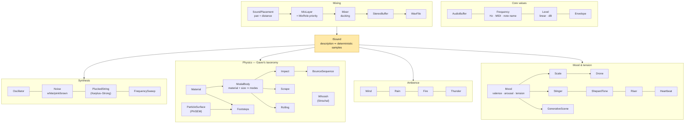

# RP.Sound — the physics and psychology of game audio, explained

> A procedural audio library for C#, written to be **read and understood** before it is used.
> It is a **tutorial in code**: a guided tour of how real sounds come to exist — why steel rings
> and wood thuds, why a bounce accelerates, why a horror scene *feels* like horror — aimed at
> anyone meeting procedural audio for the first time. Nothing here plays back recordings: every
> sound is **synthesised from a description** of the physical event or emotional intent behind it,
> with the science explained at every step. It is the companion to
> [RP.Math](../Math/README.md) and follows the same design philosophy: small immutable value
> objects, uniform conventions applied without exception, clarity ahead of speed.

---

## Contents

- [What this project is for](#what-this-project-is-for)
- [Conventions used across the library](#conventions-used-across-the-library)
- [The types at a glance](#the-types-at-a-glance)
- [The core: buffers, frequencies, levels, envelopes](#the-core-buffers-frequencies-levels-envelopes)
- [Synthesis: oscillators, noise, and a plucked string](#synthesis-oscillators-noise-and-a-plucked-string)
- [Effects: filters, echo, reverb, distortion](#effects-filters-echo-reverb-distortion)
- [Physical modelling: how objects sound](#physical-modelling-how-objects-sound)
  - [Materials](#materials)
  - [Modal bodies — an object's voice](#modal-bodies--an-objects-voice)
  - [Impact](#impact)
  - [Gravity and the bounce](#gravity-and-the-bounce)
  - [Scrape and roll](#scrape-and-roll)
  - [Granular surfaces (PhISEM)](#granular-surfaces-phisem)
  - [Footsteps](#footsteps)
  - [Whoosh — the sound of speed](#whoosh--the-sound-of-speed)
- [Ambience: wind, rain, fire, thunder](#ambience-wind-rain-fire-thunder)
- [Mood, tension and genre](#mood-tension-and-genre)
- [Layering: keeping every sound functional](#layering-keeping-every-sound-functional)
- [The showcase application](#the-showcase-application)
- [Academic sources](#academic-sources)
- [Decisions captured here](#decisions-captured-here)
- [Future considerations](#future-considerations)
- [Status and history](#status-and-history)

---

## What this project is for

Game audio is usually made by recording thousands of samples and triggering them. That works, but
it teaches nothing, scales badly (every material × velocity × surface combination is another
recording), and cannot respond continuously to physics. **Procedural audio** — synthesising the
sound from the event itself — is the other road (Farnell's *Designing Sound* is its manifesto),
and it is a wonderful teaching vehicle, because every sound becomes a small physics lesson:

- An **impact** is loud in proportion to its kinetic energy and bright in proportion to its
  hardness, because hard contact is *brief* contact and brief pulses carry high frequencies.
- A **bounce** accelerates audibly because each interval is `2v/g` and `v` shrinks geometrically.
- **Thunder** rumbles when distant because air eats high frequencies first.
- A **horror scene** unsettles because dissonance, low register, darkness and unresolved
  expectation are each measurable, mappable quantities.

This library covers the sound palette a triple-A game needs — contact sounds driven by velocity,
gravity, mass and material; granular surfaces and footsteps; whooshes; generative weather beds;
mood-driven underscore and tension devices; and a mixing layer that keeps it all intelligible —
each grounded in the published research ([sources below](#academic-sources)) and documented as a
teaching resource. The code favours clarity over raw DSP speed, exactly as RP.Math favours
readable maths over SIMD.

---

## Conventions used across the library

Stated once, applied everywhere, no exceptions — cohesion is a discipline, not an adjective.

**Everything audible is an immutable description implementing one contract.** `ISound` has a
`Duration` (which may be `PositiveInfinity` — wind has no natural end) and
`Render(context, duration)`, which always returns *exactly* the requested length. Descriptions
never change; operations return new descriptions; rendering never mutates the description.

**Rendering is a pure function: (description, context) ⇒ identical samples, every time.** The
`AudioRenderContext` carries the sample rate and master seed; components derive named random
streams from it, so composing sounds never disturbs each other's randomness. Same seed, same
audio — a bounce heard in a replay is the bounce that was heard live. The test suite holds every
stochastic generator to this.

**Units are always wrapped.** A bare `double` never leaves you guessing: pitch is a `Frequency`
(hertz ↔ MIDI note ↔ note name), loudness is a `Level` (linear gain ↔ decibels) — the same
discipline RP.Math applies to angles with `Angle`. A bare number converts implicitly where the
reading is fixed (a double *is* hertz, as a double *is* radians); construction that asserts a
precondition is explicit. Physical quantities are SI: metres, m/s, kg, kg/m³, pascals.

**Strict and safe forms.** Normalising silence is undefined: `Normalized()` throws
(`NormalizeSilentBufferException`), `NormalizedOrDefault()` returns the buffer unchanged.
`Frequency.FromNote` throws on nonsense; `TryFromNote` reports false. Same pattern, everywhere
it applies.

**Static and instance forms of buffer operations** (`AudioBuffer.Mix(a, b)` / `a.MixedWith(b)`),
with the instance form calling the static one, so the two can never disagree.

**Invalid states are unconstructible.** A `Material` cannot have negative density; a `Mood`
cannot leave the valence–arousal–tension box; an `Echo` cannot be built with unity feedback (it
would never decay); restitution of 1 is rejected (the bounce would never end). Constructors
validate; the type system holds the line after that.

**What a sound *is* is separate from *where it sits*.** Sounds are mono descriptions; pan and
distance belong to a `SoundPlacement`, and role/priority to a `MixLayer` — the same split
RP.Math draws between a conceptual shape and the `Pose` that places it. Only the mix is stereo.

**Transient render state is the one sanctioned exception to immutability.** A random generator
mid-stream and a filter mid-signal are stateful by nature (`DeterministicRandom`, the internal
`Biquad`). They are never part of a description — they are created inside `Render` and die there.

---

## The types at a glance



| Type | What it models | The science behind it |
|------|----------------|----------------------|
| `AudioBuffer` | Finished mono samples at a rate | — |
| `Frequency` | A rate of vibration | Equal temperament: semitone = 2^(1/12) |
| `Level` | An amount of loudness | dB = 20·log₁₀(gain); perception is logarithmic |
| `Envelope` | A loudness contour (ADSR) | Physical decays are exponential |
| `Oscillator`, `Noise`, `FrequencySweep` | Raw tonal / noisy material | Harmonic series; 1/f spectra |
| `PluckedString` | A plucked string | Karplus & Strong (1983) |
| `Filter`, `Echo`, `Reverb`, `Distortion` | The signal processors | RBJ biquads; Schroeder (1962) |
| `Material` | What something is made of | Density, Young's modulus, loss factor, restitution |
| `ModalBody` | An object that can ring | Modal synthesis; free-bar vibration |
| `Impact` | One strike | van den Doel & Pai; Hertz contact |
| `BounceSequence` | A drop bouncing to rest | v = √(2gh); intervals 2v/g scaled by e |
| `Scrape`, `Rolling` | Sustained contact | Gaver's taxonomy; excitation ∝ speed |
| `ParticleSurface` | Gravel, sand, leaves, snow | Cook's PhISEM |
| `Footsteps` | A walker on a surface | Cadence = speed ÷ stride |
| `Whoosh` | Speed through air | Strouhal: f = 0.2·v/d |
| `Wind`, `Rain`, `Fire`, `Thunder` | Weather beds | Turbulence spectra; Poisson processes; air absorption |
| `Mood` | Emotional intent as coordinates | Russell's circumplex + Huron's tension |
| `Scale`, `Drone`, `Stinger` | Mood as harmony | Consonance/dissonance; register |
| `ShepardTone`, `Riser`, `Heartbeat` | Tension devices | Shepard (1964); expectation psychology |
| `GenerativeScene` | A whole genre soundscape | All of the above through the mixer |
| `SoundPlacement`, `MixLayer`, `Mixer`, `StereoBuffer` | Where sounds sit and who wins | Bregman's auditory scene analysis; equal-power law |
| `WavFile` | 16-bit PCM encoding | The RIFF/WAVE container |

---

## The core: buffers, frequencies, levels, envelopes

**`AudioBuffer`** is the finished article: immutable mono samples plus their rate. Operations —
`Amplified`, `MixedWith`, `MixedAt(offset)`, `Then` (concatenate), `FadedIn/Out`,
`FittedToDuration`, `Normalized`/`NormalizedOrDefault`, `SoftClipped` — all return new buffers.
Mixing buffers of different sample rates throws rather than silently changing pitch.

**`Frequency`** stores hertz and converts losslessly to the musician's coordinate systems.
Equal temperament makes every semitone the same *ratio* (2^(1/12) ≈ 1.0595), because pitch
perception is logarithmic — an octave is a doubling wherever it starts. MIDI note 69 is pinned
to 440 Hz (concert A), giving `FromMidiNote`, `MidiNote`, `FromNote("C#4")` and
`Transposed(semitones)`.

**`Level`** stores a linear amplitude gain and converts to decibels (`20·log₁₀`). Decibels exist
because loudness perception is also logarithmic: −6 dB (half amplitude) sounds like one step
quieter, whether from a whisper or a shout. Gains compose by multiplication — which is addition
in dB.

**`Envelope`** is the classic ADSR loudness contour with a deliberate default: falling segments
curve *exponentially*, because that is how physical vibration dies (each cycle loses the same
fraction of its energy) — a linear fade sounds mechanical. `Envelope.Percussive` is the shape of
every struck thing; `Envelope.Sustained` the shape of every bed.

**The combinators** (`Amplified`, `Shaped`, `Delayed`, `Then`, `MixedWith`, `Repeated`,
`Trimmed`, `Sounds.Mix`, `Sounds.Silence`) make every sound composable with every other through
the same handful of operations — each returning a new immutable description.

---

## Synthesis: oscillators, noise, and a plucked string

**`Oscillator`** produces the four classic waveforms, ordered by harmonic content: sine (the
pure atom — one frequency), triangle (odd harmonics falling fast), square (odd harmonics,
hollow), sawtooth (every harmonic — the raw material you filter into almost anything). The
shapes are generated in their ideal mathematical form for readability; the cost is mild aliasing
on bright waveforms at high pitch (band-limited generation is [future work](#future-considerations)).

**`Noise`** comes in three colours, named by analogy with light: **white** has equal energy at
every frequency (hiss); **pink** falls 3 dB/octave — equal energy per *octave*, which is how most
of nature distributes sound (wind, waterfalls, rain); **brown** falls 6 dB/octave (deep rumble —
it is integrated white noise, the audio of a random walk). Pink is made with Kellet's three-pole
approximation; brown with a leaky integrator.

**`PluckedString`** is the Karplus–Strong algorithm (1983), the classic teaching example of
physical modelling because it is almost absurdly economical: fill a delay line one period long
with noise (the pluck), then recirculate it through a two-point average. Each round trip is one
vibration; the averaging low-pass makes high harmonics die first, exactly as on a real string.
A dozen lines that genuinely sound like a guitar.

---

## Effects: filters, echo, reverb, distortion

**Filters** are RBJ-cookbook biquads — the standard reference formulas. Low-pass is the
workhorse of *distance and muffling*; high-pass removes body; band-pass is the shape of
resonance (and does most of the work in the physics namespace). Q is resonance: 0.707 is flat,
higher rings.

**`Echo` vs `Reverb`** is a distinction worth teaching: an echo's repeats are meant to be heard
individually (feedback delay); reverberation is reflections so dense they fuse into a wash. The
reverb is Schroeder's 1962 structure — four parallel comb filters at mutually prime delays (so
their repeats never align into an audible pattern) into two series all-passes that smear phase
until the tail is smooth. Room size scales comb feedback (decay time); damping low-passes inside
the loops, darkening every round trip like soft furnishings do.

**`Distortion`** is tanh soft-clipping: flattening peaks adds odd harmonics, heard as grit and
aggression — which is why threat-leaning sound design reaches for it deliberately.

---

## Physical modelling: how objects sound

The organising idea comes from Gaver's *ecological acoustics*: people do not hear "a 440 Hz tone
with decaying partials" — they hear *a metal bar dropped on concrete*. Everyday listening
perceives **events**, and Gaver's taxonomy of solid-object events — **impact, scraping,
rolling** — is the backbone of this namespace. The synthesis recipe for all three is modal
synthesis, made practical for interaction by van den Doel & Pai's *FoleyAutomatic*: an object's
sound is (very nearly) nothing but its resonant modes ringing down, so model the modes and you
have modelled the object.

### Materials

`Material` holds the real physical constants, SI units, handbook values:

| Preset | Density kg/m³ | Young's E | Loss factor η | What that means audibly |
|--------|--------------|-----------|---------------|--------------------------|
| `Steel` | 7850 | 200 GPa | 0.0002 | high, *sings for seconds* |
| `Glass` | 2500 | 70 GPa | 0.001 | bright, clean, ringing |
| `Ceramic` | 2400 | 70 GPa | 0.0008 | glass's cousin, harder attack |
| `Stone` | 2700 | 50 GPa | 0.004 | solid mid ring, short |
| `Ice` | 917 | 9 GPa | 0.008 | brittle, glassy but dead |
| `Wood` | 700 | 12 GPa | 0.02 | warm *thud*, milliseconds |
| `Plastic` | 1200 | 3 GPa | 0.03 | dull, cheap-sounding |
| `Rubber` | 1100 | 0.05 GPa | 0.15 | barely a thump |

Two derived quantities do most of the audible work:

- **√(E/ρ)** — the speed of sound in the material, its "voice speed". Stiff-and-light (steel,
  glass) rings *high* for its size; soft-and-dense rings low.
- **1/(π·f·η)** — the decay time of a mode with loss factor η. Metal's tiny η is why it rings a
  thousand times longer than rubber, and because f is in the denominator, *every* object's high
  modes die first — the universal "bright attack mellowing into the fundamental".

Each material also carries `Hardness` (contact brightness, below) and `Restitution` (the bounce
fraction). Invalid physics — negative density, restitution ≥ 1 — cannot be constructed.

### Modal bodies — an object's voice

`ModalBody` is a material given a size, and derives the modes from the vibration formula for a
free bar (the classic struck object — xylophone key, dropped plank, ringing pipe):

```
f₁ = (k₁²/2π) · (h/L²) · √(E/12ρ)        k₁L = 4.730 for a free–free bar
```

with thickness h fixed at L/10 so that size alone moves pitch (halve the bar, double the pitch —
as real bars do). Higher modes sit at the bar's fixed **inharmonic** ratios (2.76, 5.40, 8.93,
13.3 × f₁) — not the harmonic series, which is precisely why struck objects "clang" rather than
sound musical. Each mode gets its physical decay 1/(π·f·η) and a 1/n level falloff. A 0.5 m
steel bar comes out around 1 kHz and rings for seconds; the same bar in wood sits lower and is
gone in 50 ms. The tests pin these relationships (smaller ⇒ higher; stiffer ⇒ higher; lossier ⇒
shorter; higher modes ⇒ shorter).

### Impact

`Impact` is the fundamental contact event, and each parameter maps to a physical law:

- **Velocity → loudness.** Kinetic energy is ½mv², so amplitude grows with v·√m, squashed
  through tanh because loudness perception is compressive (a cannonball is louder than a pebble,
  but not a thousand times louder).
- **Hardness → brightness.** Hertzian contact: hard-on-hard contact is *brief* (~0.2 ms), soft
  contact long (~4 ms). A force pulse of width τ carries almost no energy above 1/τ, so each
  mode is weighted by 1/(1+(f·τ)²). This one line is why a marble *tinks* and a rubber mallet
  *thumps* on the same glass — same modes, different excitation window.
- **The contact click.** A noise burst exactly as long as the contact, band-limited to the same
  law — the first millisecond's "snap" that pure modal ringing lacks.

`Impact.FromDrop(body, height, gravity)` closes the loop with mechanics: v = √(2gh), with
gravity an explicit parameter — the same drop genuinely sounds different on the Moon.

### Gravity and the bounce

`BounceSequence` needs no animation data because projectile physics *is* the rhythm: an object
leaving the floor at speed v returns in 2v/g seconds, and restitution e scales v each bounce, so
both intervals and loudness shrink geometrically — the accelerating "b-d-d-drrp" every listener
recognises as *bouncing to rest*. The schedule (`Bounces`) is exposed so a game can sync visuals
to it, and the tests verify interval ratios equal e exactly. ±2% timing jitter keeps the tail
from sounding metronomic; the physics stays audible through it.

### Scrape and roll

**`Scrape`** (Gaver's second event): dragging across surface bumps produces noisy excitation at
`speed × bump density` Hz — drag twice as fast, the hiss rises an octave, which is exactly the
cue ears use to judge scraping speed. The excitation then rings the scraped body's own modes
(quietly — scraping feeds energy gently), so scraping steel sounds steely and wood woody. A
wandering speed drift keeps it alive.

**`Rolling`** (the third) is revealed as a hybrid: a stream of micro-impacts — one per surface
bump, at a rate that falls straight out of geometry, v/2πr revolutions per second — over a
speed-dependent rumble. Slow it down and it decomposes audibly into individual clicks.

### Granular surfaces (PhISEM)

Gravel, sand, leaves and snow are thousands of tiny colliding grains — hopeless to simulate
individually, and Perry Cook's **PhISEM** (Physically Informed Stochastic Event Modeling) is the
insight that you don't have to: treat the collisions as a *Poisson process whose rate follows
the system's energy*. One shot of energy (a footfall); collisions arrive at random at
`rate × energy`; each is a tiny ping through the grain's resonance; the energy decays and the
crunch thins with it. Four presets differ only in grain brightness, collision rate and settle
time — the same code is gravel or snow.

### Footsteps

`Footsteps` composes the above into the sound a game plays most often. A footstep is **two**
events — heel strike then toe slap, the gap closing with pace until a run merges them — and its
cadence comes from locomotion itself: steps ≈ speed ÷ stride (0.75 m), so the rhythm follows the
character's actual velocity. On hard floors the "instrument" is a floor board of that material
struck softly (modal); on loose ground each step is a PhISEM burst. No two footfalls are
identical (±1.5 dB, ±4% timing, alternating feet) — sameness is the giveaway of faked footsteps.

### Whoosh — the sound of speed

The pitch of a whoosh is real aeroacoustics: air shedding vortices behind a body of diameter d
at speed v oscillates at the **Strouhal frequency f ≈ 0.2·v/d** — the same law that makes
telephone wires sing. A sword (5 cm) at 20 m/s whooshes around 80 Hz plus broadband turbulence;
a pass-by sweeps the centre downward (the Doppler cue) with loudness peaking at closest approach.

---

## Ambience: wind, rain, fire, thunder

Ambience is Schafer's "keynote" layer of a soundscape — the sound a place *is*, heard but rarely
listened to. All four generators are endless (`Duration = ∞`; ask for what you need), and each
is a small lesson in what the ear actually keys on:

- **`Wind`** is not hiss but *gusts*: noise through a resonant band ridden by a slow (0.1–1 Hz)
  wandering swell. The swell is the identity; a narrow whistle resonance joins only in strong
  wind. Strength and gustiness are the two handles.
- **`Rain`** is a sum the ear takes apart: a fused broadband bed (the countless distant drops)
  plus a Poisson scatter of individually audible near ones. Surface hardness brightens the drops
  exactly as striker hardness brightens an impact — a tin roof is a hard surface.
- **`Fire`** is three sounds in one, and listeners recognise all three: the low **roar** of
  turbulent combustion (brown noise), the **hiss** of escaping gases, and sparse bright
  **crackles** (Poisson events, each ringing a random high resonance — a different fibre snaps
  each time). Intensity moves the balance from ember-crackle to inferno-roar.
- **`Thunder`** teaches atmospheric absorption: air eats high frequencies far faster than low,
  so the *same* strike cracks at 200 m and only rumbles at 5 km. Distance is the single
  parameter; the jagged multi-peak envelope models sound arriving from different heights of the
  strike.

---

## Mood, tension and genre

The second half of the brief: scenes have *feelings* — horror, anticipation, fun, threat — and
the library treats them not as presets full of magic numbers but as **coordinates in the space
psychology actually measures**.

**`Mood`** has three axes:

- **Valence** (unpleasant → pleasant) and **arousal** (calm → energised) are Russell's
  *circumplex model of affect* (1980), the standard two-dimensional account of emotion, widely
  validated for musical emotion in particular.
- **Tension** is the third axis games cannot do without: Huron's *Sweet Anticipation* locates
  suspense in *unresolved expectation* (his ITPRA theory — imagination, tension, prediction,
  reaction, appraisal). Sustained not-knowing-when is a feeling of its own, orthogonal to
  pleasantness.

Genres are named points: `Horror` = (−0.9, 0.2, 0.9), `Fun` = (0.8, 0.5, 0.1), `Threat`,
`Anticipation`, `FastPaced`, `Calm`, `Sad`, `Triumphant`. The mapping properties turn
coordinates into synthesis decisions, each grounded in the music-psychology literature:

| Coordinate | Drives | Why |
|-----------|--------|-----|
| Arousal ↑ | Tempo, event density | Tempo is the strongest arousal cue in music-emotion studies |
| Valence ↓ | Register down, brightness down | Low + dark = big + threatening (ecological threat cues) |
| Valence | Scale: major / minor / Phrygian | Mode is the classic valence cue; Phrygian's ♭2 is menace |
| Tension ↑ | Detune between voices | Beating close pitches = psychoacoustic *roughness* (Zwicker & Fastl) — the texture of unease |
| Tension > 0.75 | The semitone **cluster** scale | Packed dissonance is barely music, all pressure |

**`Scale`** carries the pitch sets (major, minor, Phrygian, Lydian, whole-tone, pentatonic, and
the cluster); **`Drone.ForMood`** voices the underscore bed from them — root and fifth always,
the third only when valence commits, a tritone/♭2 grafted on as tension climbs — through detuned
sawtooth pairs under the mood's brightness.

The tension devices are the psychology made audible:

- **`ShepardTone`** (Shepard, 1964) — the auditory barber's pole: octave-spaced voices gliding
  under a fixed loudness window, so the rise never arrives. Endlessly deferred arrival is
  Huron's tension response in its purest form; Zimmer's *Dunkirk* score is built on it. The test
  suite checks the loudness genuinely stays level while it "rises".
- **`Riser`** — every escalation cue at once (pitch climbing, noise brightening, loudness
  swelling on an x² ramp, a pulse accelerating), ending at its loudest instant so the next event
  lands on the peak.
- **`Stinger`** — the accent hit: a mood-voiced chord over a *real modal impact* (dark moods
  strike a big stone body, bright ones a small steel one) into a hall reverb. The mood system
  and the physics system meeting in one sound.
- **`Heartbeat`** — not a metaphor: fear raises the listener's own pulse, and a heard pulse
  invites the body to follow. `Heartbeat.ForMood` derives BPM from arousal + tension.

**`GenerativeScene`** assembles a whole genre: weather beds scaled by unease, the mood drone,
the Shepard rise above 0.55 tension, the heartbeat above 0.65, and sparse Poisson-scheduled
accents (stingers and risers at the mood's event density) — all through the mixer below, all
deterministic per seed. One seed is *a* horror night; the next seed is a different night in the
same place.

---

## Layering: keeping every sound functional

The brief's hardest requirement — "layer sounds so they remain functional in their intent" — is
a psychoacoustics problem before it is an engineering one. Bregman's *Auditory Scene Analysis*
describes how listeners parse simultaneous sound into streams; **masking** is what happens when
they cannot (one sound's energy hides another's in the same band at the same time). A mix is
functional when every layer's *intent* survives the others. Three tools exist:

1. **Priority ducking (implemented in `Mixer`).** Every layer declares a `MixRole` — `Ambience`
   < `Music` < `Foley` < `Effects` < `Critical` — ordered by narrative priority: how much the
   *player* needs it. When a higher-priority layer is loud, lower layers are attenuated 3 dB per
   priority step (max 12), with 10 ms attack (duck *before* the masking) and 400 ms release (the
   bed swells back rather than pumping). A footstep is never buried by its own weather; a
   jump-scare hit silences everything for exactly as long as it needs.
2. **Spectral slots (a design discipline).** Streams separate by frequency: the library's
   defaults already carve them — the heartbeat lives below 150 Hz, drones in the low-mids,
   footsteps in the mids, rain drops and crackle up high.
3. **Onset spacing (a scheduling discipline).** Simultaneous onsets fuse into one perceived
   event; `GenerativeScene` schedules its accents sparsely so each reads as itself.

The stereo stage follows the physics of listening: **equal-power panning** (cos/sin gains, so a
sound crossing the field never dips in loudness — verified by test), and **distance as two cues
together** — 1/d loudness *and* air-absorption low-pass — because quiet-but-bright reads as
"small and near", not "far". `SoundPlacement` is to a sound what RP.Math's `Pose` is to a shape:
the thing itself never changes; only where it stands does.

---

## The showcase application

`RP.Sound.Showcase` is an ASP.NET Core minimal API with a Svelte front end that demonstrates and
exercises every generator. Each endpoint renders a description to WAV deterministically —
`seed` re-rolls the random character without changing the physics.

```bash
# 1. Build the client (once, or after client changes)
cd showcase-client
npm install
npm run build          # outputs into RP.Sound.Showcase/wwwroot

# 2. Run the server
cd ..
dotnet run --project RP.Sound.Showcase --urls http://localhost:5225
# open http://localhost:5225
```

The page groups the demos as this document does — contact physics (impact, bounce with a gravity
slider, scrape, roll, whoosh, pluck), granular surfaces and footsteps, ambience, mood and
tension, and the full generative scene with genre selector and weather toggles. Every card shows
the rendered waveform and a **Re-roll** button (new seed, same physics). For client development,
`npm run dev` serves the Svelte app with hot reload, proxying `/api` to the .NET server.

The API surface (`/api/meta` lists the presets):

| Endpoint | Description |
|----------|-------------|
| `/api/physics/impact?material&size&velocity&hardness&seed` | one strike |
| `/api/physics/drop?material&size&height&gravity` | bounce-to-rest from a drop |
| `/api/physics/scrape?material&speed&roughness&force&duration` | sustained scrape |
| `/api/physics/roll?material&radius&speed&duration` | rolling |
| `/api/physics/surface?name&energy` | one PhISEM crunch |
| `/api/physics/footsteps?surface&speed&weight&duration` | hard or granular surface |
| `/api/physics/whoosh?speed&size&duration&passBy` | Strouhal whoosh |
| `/api/synth/pluck?note&damping` | Karplus–Strong |
| `/api/ambience/{wind,rain,fire,thunder}` | the beds |
| `/api/music/{drone,shepard,riser,stinger,heartbeat}` | mood & tension |
| `/api/scene?mood&wind&rain&fire&duration&seed` | the full layered stereo scene |

---

## Academic sources

The research this library is built on, per area:

**Ecological perception and physically-based contact sounds**

- W. W. Gaver, [*What in the World Do We Hear? An Ecological Approach to Auditory Event
  Perception*](https://www.tandfonline.com/doi/abs/10.1207/s15326969eco0501_1), Ecological
  Psychology 5(1), 1993 — the impact/scrape/roll taxonomy and the case that we hear *events*.
- K. van den Doel, P. G. Kry, D. K. Pai, [*FoleyAutomatic: Physically-based Sound Effects for
  Interactive Simulation and Animation*](http://www.cs.ubc.ca/~kvdoel/publications/foleyautomatic.pdf),
  SIGGRAPH 2001 — modal synthesis excited by physically parameterised impact, scrape and roll.
- P. R. Cook, [*Physically Informed Sonic Modeling (PhISM): Percussive
  Synthesis*](https://quod.lib.umich.edu/i/icmc/bbp2372.1996.071?rgn=main;view=fulltext),
  ICMC 1996 — the stochastic particle model behind `ParticleSurface`.
- K. Karplus, A. Strong, *Digital Synthesis of Plucked-String and Drum Timbres*, Computer Music
  Journal 7(2), 1983 ([overview](https://ccrma.stanford.edu/~jos/pasp/Karplus_Strong_Algorithm.html)).

**Signal processing**

- M. R. Schroeder, *Natural Sounding Artificial Reverberation*, JAES 1962
  ([context](https://valhalladsp.com/2009/05/30/schroeder-reverbs-the-forgotten-algorithm/)).
- R. Bristow-Johnson, *Audio EQ Cookbook* — the biquad coefficient formulas.

**Emotion, tension and musical expectation**

- J. A. Russell, [*A Circumplex Model of Affect*](https://psycnet.apa.org/record/1981-25062-001),
  J. Personality & Social Psychology 39(6), 1980 — the valence/arousal space `Mood` lives in.
- D. Huron, [*Sweet Anticipation: Music and the Psychology of
  Expectation*](https://books.google.com/books/about/Sweet_Anticipation.html?id=uyI_Cb8olkMC),
  MIT Press 2006 — the ITPRA theory behind the tension axis and the anticipation devices.
- R. N. Shepard, *Circularity in Judgments of Relative Pitch*, JASA 36, 1964 — the endless rise
  ([its use in *Dunkirk*](https://www.filmscalpel.com/dunkirks-shepard-tone/)).
- E. Zwicker, H. Fastl, *Psychoacoustics: Facts and Models*, Springer — roughness, masking,
  loudness; the reason detune maps to unease.

**Scene analysis, layering and soundscape**

- A. S. Bregman, [*Auditory Scene Analysis: The Perceptual Organization of
  Sound*](https://mitpress.mit.edu/9780262022972/auditory-scene-analysis/), MIT Press 1990 —
  streams, masking, and why the mixer's job is perceptual, not electrical.
- R. M. Schafer, *The Soundscape: Our Sonic Environment and the Tuning of the World*, 1977 —
  keynote sounds vs. signals; the vocabulary of the ambience layer.
- A. Farnell, *Designing Sound*, MIT Press 2010 — the procedural-audio approach as a whole.
- K. Collins, *Game Sound*, MIT Press 2008 — adaptive/dynamic audio practice in games.

---

## Decisions captured here

- **Descriptions, not streams.** A sound is an immutable value describing what would be heard;
  rendering is offline, pure and deterministic. Real-time streaming is deferred (below), not
  compromised into the core model.
- **Determinism is a contract, tested.** Every stochastic generator derives named streams from
  the context seed; `System.Random` is banned (unstable across runtimes).
- **One interface for everything audible.** `ISound.Render(context, duration)` always returns
  exactly the requested duration; infinite sounds are first-class (`Duration = ∞`).
- **Units wrapped, physics SI.** `Frequency` and `Level` carry their units; materials use
  handbook constants, not "wood-ness" sliders.
- **Physics first, heuristics second, and labelled.** Where a true model is impractical the
  simplification is stated in the doc comment (contact-time heuristic, bar aspect ratio,
  loudness tanh) with the trend it preserves.
- **Mono sound / placed sound split.** What a sound is vs. where it sits (pan, distance, role),
  mirroring RP.Math's conceptual/placed shapes. Only mixes are stereo.
- **Mood is coordinates, not presets.** Genres are named points in valence–arousal–tension
  space; every generator reads the same mapping, so the "genres" can never drift apart.
- **Priority ducking in the mixer.** Narrative priority (`MixRole`) is data, and the mix
  protects it automatically — intent survives layering by construction.
- **Transient state is quarantined.** Generators and filters mutate only inside `Render`;
  nothing observable escapes.

---

## Future considerations

Thought through, deliberately not yet built — recorded so the eventual work starts from a
conclusion (the RP.Math discipline):

- **Real-time streaming.** The natural evolution: an `ISoundStream` pulling blocks
  (`Read(Span<float>)`) so game engines can render continuously with parameter changes mid
  -sound. The description layer stays exactly as it is — a stream is a *stateful reader of a
  description*, the same relationship `Biquad` already has to a filter setting. Get the
  descriptions right first; stream them second.
- **Band-limited oscillators (polyBLEP/BLIT)** to remove sawtooth/square aliasing at high pitch.
- **Convolution reverb** (measured impulse responses) alongside Schroeder.
- **HRTF / binaural placement.** `SoundPlacement` currently does pan + distance; full 3D needs
  head-related transfer functions. The placement type is where that lives when it comes.
- **Doppler as physics.** `Whoosh` sweeps a heuristic ±30%; a real Doppler would derive the
  ratio from source velocity and the speed of sound.
- **Granular synthesis** for textures the current generators can't reach (crowds, water masses).
- **Melody and adaptive music.** `Scale` and `Mood` are the foundation; horizontal
  re-sequencing and vertical layering (Collins) would build actual score on them.
- **Measured modal data.** ModalBody derives modes from first principles; an
  `ModalBody.FromRecording(...)` fitting modes to a sample (example-guided modal synthesis)
  would marry the two worlds.
- **Loudness normalisation (LUFS)** for broadcast-consistent output levels.

---

## Status and history

The library was designed and built in one pass as a companion to RP.Math, applying its
conventions to a new domain: 104 tests pin the units, the determinism contract, the physical
relationships (faster ⇒ louder, harder ⇒ brighter, smaller ⇒ higher, restitution ⇒ bounce
timing), the psychoacoustic behaviours (equal-power pan, Shepard loudness stability, ducking),
and the WAV encoding. The showcase (ASP.NET Core + Svelte) exercises every public generator.
The core is deliberately offline-deterministic; real-time streaming is the next chapter and is
sketched above.
